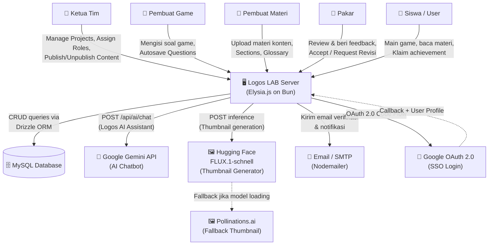
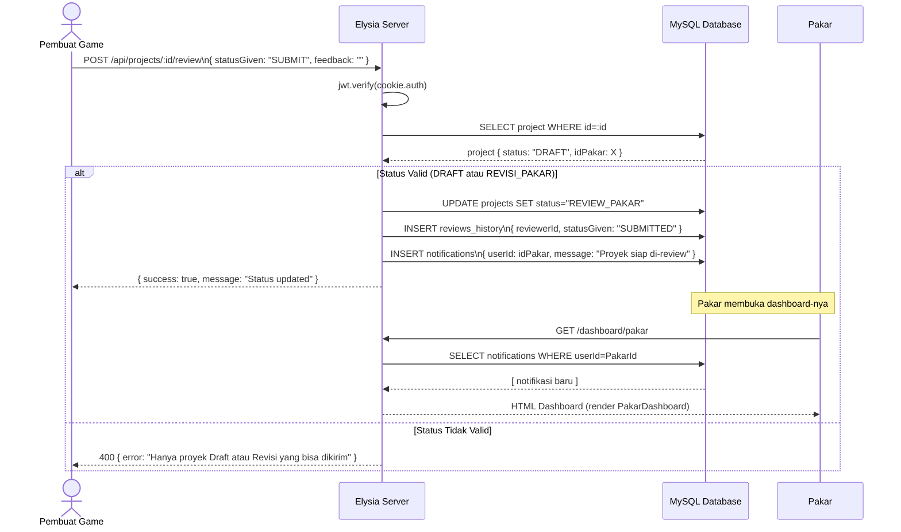

# Logos LAB — Software Architecture Documentation

> **Platform:** Logos LAB — Platform Pembelajaran Alkitab Interaktif Berbasis Game Edukatif  
> **Versi Dokumen:** 1.0  
> **Terakhir Diperbarui:** Juni 2026  
> **Penulis:** Senior Software Architect

---

## Daftar Isi

1. [High-Level Architecture (System Context)](#1-high-level-architecture-system-context)
2. [Tech Stack & Core Dependencies](#2-tech-stack--core-dependencies)
3. [Struktur Direktori (Folder Structure)](#3-struktur-direktori-folder-structure)
4. [Data Flow & Integration](#4-data-flow--integration)
5. [Architectural Decision Records (ADR)](#5-architectural-decision-records-adr)

---

## 1. High-Level Architecture (System Context)

### Gambaran Umum

Logos LAB adalah platform e-learning teologi berbasis web yang memungkinkan pembuatan, review, dan konsumsi konten edukatif dalam format game interaktif (Quiz, Fill-the-Blank, Word Search, Crossword) dan materi digital (Teks, Video, Manual). Sistem dibangun sebagai **monolith SSR (Server-Side Rendering)** dengan pola **MPA (Multi-Page Application)**, di mana server merender HTML secara penuh dan mengirimkannya ke browser.

### Aktor & Peran

| Aktor | Role Enum | Tanggung Jawab |
|---|---|---|
| **Ketua Tim** | `KETUA_TIM` | Membuat & mengatur proyek, menugaskan pembuat & pakar, mempublish konten final |
| **Pembuat Game** | `PEMBUAT_GAME` | Mengisi soal & konten game (Quiz, FTB, Word Search, Crossword) |
| **Pembuat Materi** | `PEMBUAT_MATERI` | Membuat konten materi edukatif (teks, video, manual dengan glosarium) |
| **Pakar** | `PAKAR` | Mereview dan memberikan feedback akademis pada konten sebelum dipublish |
| **Siswa / User** | `USER` | Mengonsumsi konten, bermain game, mengumpulkan skor & achievement |
| **Sistem (AI)** | — | Logos AI Assistant (Gemini), AI Thumbnail Generator (Hugging Face FLUX / Pollinations) |

### Diagram Konteks



### Alur Autentikasi

Sistem menggunakan **dua jalur autentikasi paralel**:

1. **Email + Password (Native):** Registrasi → Verifikasi Email (Nodemailer) → Login → JWT disimpan sebagai HttpOnly Cookie
2. **Google OAuth 2.0 (SSO):** Redirect ke Google → Callback → Upsert user → JWT HttpOnly Cookie

Token JWT berumur **7 hari** dan di-verify pada setiap request yang membutuhkan autentikasi melalui middleware `onBeforeHandle`.

---

## 2. Tech Stack & Core Dependencies

| Teknologi | Versi | Peran | Alasan Pemilihan |
|---|---|---|---|
| **Bun** | ^1.x | Runtime & Package Manager | Native TypeScript, performa I/O jauh lebih cepat dari Node.js, built-in test runner |
| **Elysia.js** | ^1.4.28 | Web Framework | Dioptimasi khusus untuk Bun, type-safe routing, plugin ekosistem yang mature |
| **TypeScript** | ^5.x | Bahasa Pemrograman | Type safety end-to-end, mencegah runtime errors, meningkatkan maintainability |
| **MySQL** | — | Database Relasional | Kematangan, dukungan penuh untuk relasi kompleks antar entitas (projects, users, questions) |
| **Drizzle ORM** | ^0.45.2 | ORM / Query Builder | Type-safe SQL, zero-overhead abstraction, migration tooling (drizzle-kit), cocok dengan TS |
| **mysql2** | ^3.22.3 | Database Driver | Driver resmi MySQL untuk Node/Bun, mendukung connection pooling (limit: 10 koneksi) |
| **@elysiajs/jwt** | ^1.4.2 | Autentikasi | Plugin JWT terintegrasi Elysia, tanda tangan HMAC-SHA256 |
| **@elysiajs/static** | ^1.4.10 | Static File Serving | Serve asset publik (logo, CSS, JS) dari folder `/public` dengan prefix `/public` |
| **@elysiajs/html** | ^1.4.2 | JSX/TSX Rendering | Render komponen TSX sebagai string HTML di server (SSR) |
| **bcryptjs** | ^3.0.3 | Password Hashing | Hash password dengan salt rounds=10 sebelum disimpan ke database |
| **Nodemailer** | ^8.0.7 | Email Service | Mengirim email verifikasi akun saat registrasi |
| **xlsx** | ^0.18.5 | Excel Parser | Parsing file `.xlsx` untuk bulk import soal ke Bank Soal |
| **Bootstrap Icons** | ^1.13.1 | Icon Library | Icon set yang konsisten untuk UI dashboard |
| **Alpine.js** | CDN (^3.x) | Frontend Interactivity | Lightweight reaktivitas (modal, toggle, form state) tanpa build step tambahan |
| **Tailwind CSS** | CDN | UI Styling | Utility-first CSS untuk rapid UI development di komponen TSX |
| **Google Gemini API** | `gemini-flash-latest` | AI Chatbot | Logos AI Assistant — menjawab pertanyaan kontekstual dalam bahasa Indonesia |
| **HuggingFace FLUX.1** | `FLUX.1-schnell` | AI Image Gen | Generasi thumbnail game secara otomatis berdasarkan judul proyek |
| **Drizzle Kit** | ^0.31.10 | Migration Tool | `db:generate` & `db:migrate` untuk manajemen skema database |

---

## 3. Struktur Direktori (Folder Structure)

```
logos-lab/                          # Root project
├── public/                         # 🌐 Static assets yang diakses browser langsung
│   └── index.html                  #    Landing page utama (SSR-injected oleh server)
│
├── src/                            # 🧠 Seluruh source code aplikasi
│   ├── index.tsx                   #    Entry point — inisialisasi Elysia, mount semua route,
│   │                               #    handle landing page & dashboard rendering
│   │
│   ├── db/                         # 🗄️ Lapisan Database
│   │   ├── db.ts                   #    Koneksi MySQL (connection pool, max 10 koneksi)
│   │   └── schema.ts               #    Definisi skema seluruh tabel (Drizzle ORM)
│   │
│   ├── routes/                     # 🚦 Route Handlers (Controller Layer)
│   │   ├── auth.ts                 #    POST /login, /signup, /logout, GET /google, /google/callback
│   │   ├── projects.ts             #    CRUD Proyek, Review Workflow, Game Submission, AI Thumbnail
│   │   ├── dashboard.ts            #    GET /api/dashboard/kpi-summary, /user-summary, /achievements
│   │   ├── bank_soal.ts            #    CRUD Bank Soal (Quiz, FTB, TTS) + Bulk Import Excel
│   │   ├── bank_soal_ui.ts         #    Server-side HTML render untuk halaman Bank Soal
│   │   ├── materi.ts               #    Endpoint materi konten, read progress tracker
│   │   ├── word_search.ts          #    CRUD & gameplay Word Search
│   │   ├── crossword.ts            #    CRUD & gameplay Crossword (TTS)
│   │   ├── ai.ts                   #    POST /api/ai/chat — Logos AI Assistant via Gemini
│   │   ├── users.ts                #    User management utilities
│   │   └── elearning/              #    Modul E-Learning Adaptif
│   │       ├── tags.ts             #    CRUD Tag untuk tagging soal & materi
│   │       ├── review.ts           #    Pencatatan log jawaban siswa per tag
│   │       └── adaptive-recommend.ts # GET rekomendasi materi berdasarkan tag terlemah user
│   │
│   ├── services/                   # ⚙️ Business Logic Layer (dipisah dari route)
│   │   ├── dashboardService.ts     #    Kalkulasi KPI, Spider Chart, Funnel Chart, Heatmap
│   │   └── achievementService.ts   #    Engine Gamifikasi: recalculate ranking, get achievements
│   │
│   ├── utils/                      # 🔧 Shared Utilities
│   │   └── mailer.ts               #    Konfigurasi Nodemailer & fungsi sendVerificationEmail()
│   │
│   └── views/                      # 🖼️ Presentation Layer (SSR Components)
│       ├── layouts/
│       │   └── Layout.tsx          #    Shell HTML dashboard (Sidebar, Navbar, Slot konten)
│       ├── components/             #    Komponen UI yang di-render server-side sebagai string HTML
│       │   ├── Navbar.tsx          #    Navbar adaptif (guest vs authenticated user)
│       │   ├── Sidebar.tsx         #    Sidebar navigasi dashboard
│       │   ├── KetuaTimDashboard.tsx        # Dashboard Ketua Tim (KPI Cards, Spider Chart)
│       │   ├── KetuaTimAllProjects.tsx      # Manajemen seluruh proyek (table + modals)
│       │   ├── PembuatGameDashboard.tsx     # Workspace Pembuat Game (editor soal Quiz, FTB, WS, CW)
│       │   ├── PembuatMateriDashboard.tsx   # Workspace Pembuat Materi (upload, sections, glossary)
│       │   ├── PakarDashboard.tsx           # Dashboard Pakar (review queue, feedback)
│       │   ├── MemberDashboard.tsx          # Dashboard Siswa (game list, progress)
│       │   ├── MemberAchievements.tsx       # Halaman achievement & badge siswa
│       │   ├── BankSoalQuiz.tsx             # Komponen tabel + CRUD Bank Soal Quiz
│       │   ├── BankSoalFtb.tsx              # Komponen Bank Soal Fill-the-Blank
│       │   ├── BankSoalTts.tsx              # Komponen Bank Soal TTS/Crossword
│       │   ├── CrosswordEditor.tsx          # Editor interaktif untuk game TTS
│       │   ├── CrosswordGame.tsx            # Game player TTS untuk siswa
│       │   ├── WordSearchEditor.tsx         # Editor game Word Search
│       │   ├── WordSearchGame.tsx           # Game player Word Search
│       │   ├── MateriViewer.tsx             # (Deprecated) Reader materi (PDF, Video, Manual)
│       │   ├── MateriSection.tsx            # Section materi di landing page
│       │   ├── GamesSection.tsx             # Carousel game di landing page
│       │   ├── PersonalizedGames.tsx        # Rekomendasi game berdasarkan kompetensi user
│       │   ├── PublicGamePlayer.tsx         # Player game publik (tanpa login)
│       │   ├── FloatingChatWidget.tsx       # Widget Logos AI Assistant (floating button)
│       │   ├── OnboardingModal.tsx          # Modal onboarding pilih kompetensi (user baru)
│       │   ├── ProjectHeader.tsx            # Header detail proyek
│       │   └── ReviewerElearning.tsx        # Tampilan review e-learning untuk pakar
│       ├── pages/
│           └── EditProfile.tsx             # Halaman edit profil user
│
│   ├── components/                 # ⚛️ React.js UI Components (Baru)
│   │   ├── Navbar.tsx              #    Navbar SPA
│   │   ├── Sidebar.tsx             #    Sidebar navigasi SPA
│   │   └── ButtonCTA.tsx           #    Tombol CTA utama
│   │
│   │   ├── dashboard/              # ⚛️ React SPA Dashboard per role
│   │   │   ├── DashboardPage.tsx   #    Wrapper & router penentu role
│   │   │   ├── KetuaTimDashboard.tsx
│   │   │   ├── MemberDashboard.tsx
│   │   │   ├── MemberAchievements.tsx
│   │   │   ├── PembuatGameDashboard.tsx
│   │   │   ├── PembuatMateriDashboard.tsx
│   │   │   ├── PakarDashboard.tsx
│   │   │   ├── DashboardGamesPage.tsx      #    Halaman list & filter game untuk user
│   │   │   ├── DashboardMateriPage.tsx     #    Katalog & Viewer Materi SPA
│   │   │   ├── MateriViewerModal.tsx       #    Modal pembaca materi & kuis
│   │   │   ├── WordSearchGame.tsx          #    Komponen SPA Word Search
│   │   │   └── CrosswordGame.tsx           #    Komponen SPA Crossword
│   │   ├── Dashboard.tsx           #    Dashboard utama versi React (Deprecated/Legacy)
│   │   └── LoginPage.tsx           #    Halaman autentikasi (Login/Register) React SPA
│   │
│   ├── main.tsx                    # ⚛️ Entry point untuk React SPA (dibundle ke public/dist) dengan client-side routing sederhana
│
├── drizzle/                        # 📜 Migration files (auto-generated oleh drizzle-kit)
│   ├── 0000_*.sql → 0009_*.sql     #    Riwayat perubahan skema database secara incremental
│   └── meta/                       #    Snapshot metadata skema per-migration
│
├── drizzle.config.ts               # Konfigurasi Drizzle Kit (dialect mysql, schema path)
├── package.json                    # Dependensi & npm scripts (dev, start, db:generate, db:migrate)
├── tsconfig.json                   # Konfigurasi TypeScript compiler
├── .env                            # Variabel environment (DATABASE_URL, JWT_SECRET, API keys)
├── .env.example                    # Template .env untuk onboarding developer baru
└── .gitignore                      # Exclude node_modules, .env, dll dari Git
```

### Penjelasan Tanggung Jawab Folder Utama

- **`src/db/`** — Single source of truth untuk skema data. Semua perubahan struktur database harus dimulai dari `schema.ts` dan dieksekusi via `bun run db:migrate`.
- **`src/routes/`** — Controller layer. Setiap file bertanggung jawab pada satu domain fitur. Route handler boleh memanggil `db` langsung untuk query sederhana, atau mendelegasikan ke `services/` untuk logika yang lebih kompleks.
- **`src/services/`** — Business logic murni. Tidak ada HTTP concern di sini (tidak ada `set.status`, `cookie`, dll). Mudah diuji secara independen.
- **`src/views/`** — Presentation layer. Komponen TSX dirender menjadi string HTML di server menggunakan `@elysiajs/html`. **Tidak ada hydration client-side framework** — interaktivitas ditangani oleh Alpine.js yang di-inject via CDN.
- **`public/`** — Semua asset statis. File `index.html` adalah **shell HTML** yang dimanipulasi secara regex oleh server untuk menyuntikkan komponen dinamis (Navbar, Games Section, dll).

---

## 4. Data Flow & Integration

### 4.1 Request Lifecycle

Setiap HTTP request yang masuk ke Logos LAB melewati pipeline berikut:

```
Browser Request
      │
      ▼
┌─────────────────────────────────────────────────────┐
│  Elysia.js Router (src/index.tsx)                   │
│                                                     │
│  1. staticPlugin → cek apakah path = /public/*?    │
│     YA → serve file langsung dari /public/         │
│     TIDAK → teruskan ke router                     │
│                                                     │
│  2. Global onBeforeHandle (per route group)         │
│     → Baca cookie `auth`                           │
│     → jwt.verify(token)                            │
│     → Jika gagal → redirect / 401 JSON             │
│                                                     │
│  3. .derive() → inject { user } ke semua handler  │
│                                                     │
│  4. Route Handler                                   │
│     → Jalankan business logic                      │
│     → Query MySQL via Drizzle ORM                  │
│     → Panggil external API jika perlu              │
│                                                     │
│  5. Return Response                                 │
│     → HTML (text/html) untuk SSR pages             │
│     → JSON (application/json) untuk API endpoints  │
└─────────────────────────────────────────────────────┘
      │
      ▼
Browser (render HTML / handle JSON)
```

**Catatan penting:**
- Semua route di bawah `/dashboard/*` dan `/api/elearning/*` dilindungi dengan middleware JWT.
- Route gameplay publik (`GET /api/projects/:id`, `POST /api/projects/:id/submit`) sengaja di-bypass dari middleware agar game dapat dimainkan tanpa login.
- Header `Cache-Control: no-store` diset secara eksplisit pada semua halaman dashboard untuk mencegah akses pasca-logout melalui tombol Back browser.

### 4.2 Project Content Lifecycle (Status State Machine)

```
DRAFT ──→ REVIEW_PAKAR ──→ REVISI_PAKAR ──→ (kembali ke REVIEW_PAKAR)
                 │
                 ▼
          ACCEPTED_PAKAR ──→ REVIEW_KETUA ──→ REVISI_KETUA ──→ (kembali ke REVIEW_KETUA)
                                   │
                                   ▼
                              PUBLISHED ──→ UNPUBLISHED
```

### 4.3 Adaptive E-Learning Data Flow

```
Siswa menjawab soal
      │
      ▼
POST /api/elearning/review
  → Catat ke student_learning_logs (userId, tagId, isCorrect)
      │
      ▼
GET /api/elearning/adaptive-recommend
  → Hitung accuracy ratio per tagId dari student_learning_logs
  → Temukan tagId dengan accuracy terendah
  → Query materi yang ber-tag tersebut dan status PUBLISHED
  → Return top-5 rekomendasi materi
```

### 4.4 Sequence Diagram: Alur Submit Proyek ke Review Pakar



### 4.5 Integrasi Eksternal

| Layanan | Endpoint | Trigger | Fallback |
|---|---|---|---|
| **Google Gemini** | `generativelanguage.googleapis.com` | User kirim pesan ke Logos AI Chat Widget | Return 503 dengan pesan user-friendly |
| **HuggingFace FLUX** | `api-inference.huggingface.co/models/black-forest-labs/FLUX.1-schnell` | Ketua Tim generate thumbnail proyek | Fallback ke Pollinations.ai via server-side fetch |
| **Pollinations.ai** | `image.pollinations.ai/prompt/...` | Fallback jika FLUX model loading/error | Return `{ success: false }` |
| **Google OAuth** | `accounts.google.com/o/oauth2/v2/auth` | User klik "Login dengan Google" | Redirect ke `/` dengan `?error=google_auth_failed` |
| **SMTP (Nodemailer)** | Konfigurasi via env | User registrasi akun baru | Log error, user tetap terdaftar (email mungkin tidak terkirim) |

---

## 5. Architectural Decision Records (ADR)

---

### ADR-001: SSR Monolith dengan Elysia.js + TSX — Bukan SPA Framework

**Status:** Accepted

#### Context (Masalah)
Tim membutuhkan sebuah platform yang bisa dikembangkan dengan cepat oleh tim kecil tanpa memisahkan codebase menjadi dua project (backend API + frontend SPA). Kompleksitas deployment, CORS, state management, dan sinkronisasi tipe data antara dua codebase menjadi beban yang tidak perlu di fase awal.

#### Decision (Keputusan)
Membangun seluruh aplikasi sebagai **SSR Monolith** menggunakan Elysia.js dengan plugin `@elysiajs/html`. Komponen UI ditulis sebagai TSX function yang mereturn string HTML, dirender di server. Interaktivitas frontend minimal ditangani oleh **Alpine.js** (CDN, tidak perlu build step) dan **vanilla JavaScript** inline. Tidak ada React, Vue, atau SvelteKit.

#### Consequences (Konsekuensi)

**✅ Keuntungan:**
- **Satu codebase, satu runtime.** Developer bisa mengerjakan route handler dan UI component dalam satu konteks tanpa context switching.
- **Zero client-side hydration overhead.** HTML langsung dapat dipakai browser; tidak perlu menunggu JavaScript bundle besar.
- **Deployment sederhana.** Satu proses Bun, satu port (3000), tidak ada proxy server untuk mengkoordinasikan frontend-backend.
- **Type safety end-to-end.** Data dari Drizzle ORM langsung dipass ke TSX component dengan tipe yang konsisten.

**⚠️ Trade-off:**
- **Skalabilitas interaktivitas terbatas.** Fitur yang membutuhkan reaktivitas kompleks (misalnya real-time game multiplayer atau editor WYSIWYG) akan sulit diimplementasikan tanpa refactoring ke framework client-side.
- **State management via DOM/Alpine.** Untuk fitur editor game (Crossword, Word Search), state dikelola dengan Alpine.js dan `window` globals — rentan terhadap bug jika tidak didisiplinkan.
- **Tidak ada partial rendering.** Setiap navigasi dashboard memicu full page load dari server, bukan partial component update seperti SPA.

---

### ADR-002: Drizzle ORM + MySQL — Bukan Prisma atau Raw SQL

**Status:** Accepted

#### Context (Masalah)
Skema database Logos LAB cukup kompleks: 25+ tabel dengan relasi polymorphic (misalnya `questionTags` yang mereferensikan baik `question_bank` maupun `bank_soal_quiz`), banyak enum MySQL, dan kebutuhan untuk kueri agregasi tingkat lanjut (COUNT DISTINCT, GROUP BY, SUM dengan kondisi) untuk fitur dashboard KPI. Tim juga membutuhkan tooling migration yang andal.

#### Decision (Keputusan)
Menggunakan **Drizzle ORM** sebagai query builder type-safe di atas driver `mysql2`. `drizzle-kit` digunakan untuk membuat dan menjalankan migration file SQL. Untuk query kompleks yang tidak didukung fluently oleh Drizzle (misalnya `SUM(IF(...))`, `BETWEEN`), digunakan `sql` template literal dari `drizzle-orm` — tetap type-safe namun fleksibel.

#### Consequences (Konsekuensi)

**✅ Keuntungan:**
- **SQL-like, bukan magic.** Drizzle tidak menyembunyikan SQL; developer yang membaca kode bisa langsung memahami query yang akan dijalankan.
- **Type safety pada level kolom.** Seleksi field yang tidak ada di skema akan menyebabkan compile error, bukan runtime error.
- **Migration versioning.** Setiap perubahan skema tercatat sebagai file `.sql` di folder `drizzle/` — mudah di-review via Git dan aman untuk di-rollback.
- **Tidak ada magic virtual tables.** Berbeda dengan Prisma, tidak ada overhead runtime dari query transformation layer yang opaque.

**⚠️ Trade-off:**
- **Verbositas lebih tinggi** dibandingkan Prisma untuk relasi kompleks. Join multi-tabel memerlukan kode yang lebih eksplisit.
- **Tidak ada Prisma Studio-level GUI** bawaan — harus menggunakan `drizzle-kit studio` atau tool eksternal seperti TablePlus/DBeaver untuk inspeksi data.
- **Relasi tidak di-enforce secara otomatis di level aplikasi.** Cascading delete, referential integrity, sepenuhnya bergantung pada definisi foreign key di MySQL dan penghapusan manual yang benar di route handler (terlihat di `DELETE /api/projects/:id`).

---

### ADR-003: Migrasi Frontend Bertahap ke React.js SPA

**Status:** Accepted

#### Context (Masalah)
Kebutuhan akan komponen UI yang lebih reaktif, interaktif, dan modular (seperti Navbar, Sidebar, Dashboard) sulit di-maintain jika terus menggunakan Alpine.js dan SSR murni dari Elysia. Tim memutuskan untuk mulai menggunakan React.js untuk sisi frontend tanpa mengganggu stabilitas backend ElysiaJS yang sudah berjalan.

#### Decision (Keputusan)
Mengimplementasikan React.js secara hybrid/bertahap.
1. Membuat folder `src/components/`, `src/pages/`, dan `src/main.tsx` khusus untuk frontend React.
2. Menggunakan bundler internal Bun (`bun build`) untuk menghasilkan bundle statis `main.js` di `public/dist/`.
3. Menambahkan endpoint `GET /app` pada ElysiaJS yang melayani `app.html` sebagai kerangka utama React SPA.
4. `tsconfig.json` diubah menggunakan `"jsx": "react-jsx"` untuk mendukung kompilasi komponen React.

#### Consequences (Konsekuensi)

**✅ Keuntungan:**
- Memungkinkan pembuatan UI yang kompleks secara reaktif.
- Dapat memanfaatkan library ekosistem React.
- REST API dan backend core (ElysiaJS + Drizzle + MySQL) tetap aman dan stabil (Anti-Regression).

**⚠️ Trade-off:**
- Harus me-maintain dua sistem rendering untuk sementara waktu (SSR `@elysiajs/html` dan SPA React) selama masa transisi.
- Konfigurasi JSX di backend harus disesuaikan agar tidak berbenturan dengan `react-jsx`.

---

*Dokumen ini harus diperbarui setiap kali keputusan arsitektural signifikan dibuat atau tech stack berubah.*
